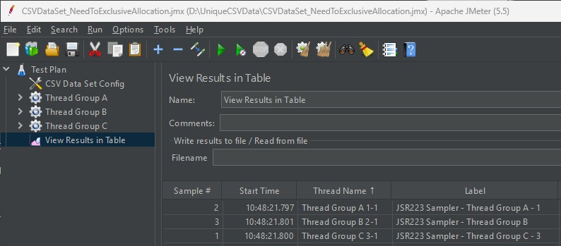
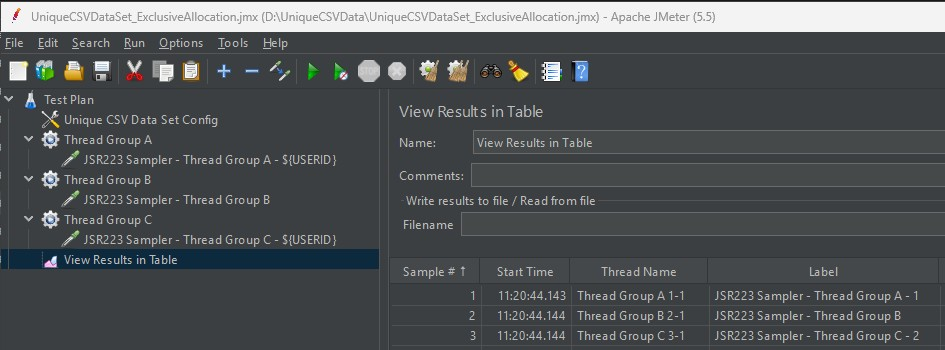
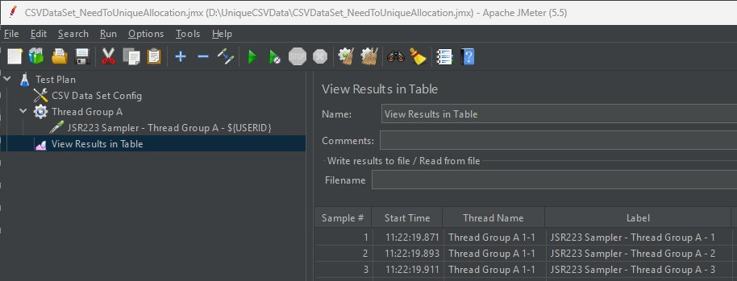
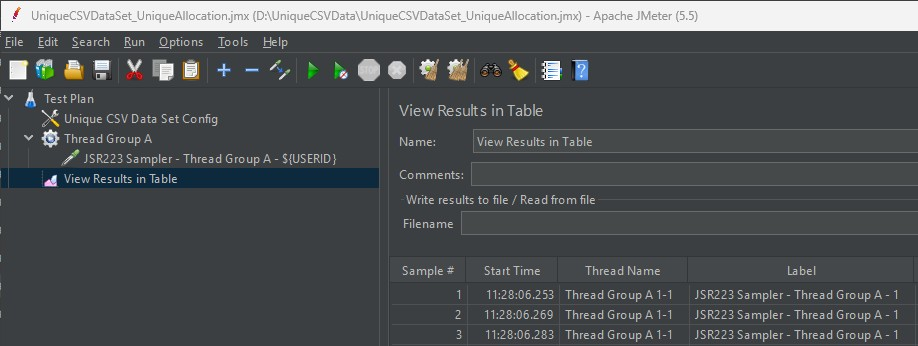
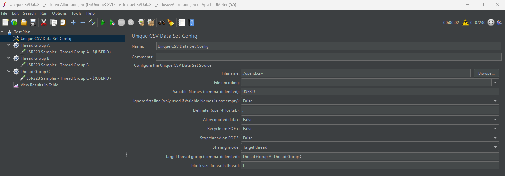

# Unique CSV Data Set Config

## Introduction
* Unique CSV DataSet Config for Jmeter
* This plugin is an extension of JMeter CSV Data Set Config component.

## Key Features
### 1. Ability to provide CSV data only to specified Thread Groups
* When a Test Plan contains multiple Thread Groups, you can specify which Thread Group will consume the CSV data
	
### 2. Ability to specify the number of data records each Thread can use (unique data allocation)
* You can predefine the number of data records that each Thread will use, and the plugin assigns unique data to each Thread with no duplication
* For example, if you have 10 Threads and 100 CSV records, the plugin can distribute 10 unique records to each Thread

## Problems and Solutions of CSV Data Set Config  
### 1. The CSV Data is consumed by a Thread Group that does not utilize the CSV Data
* CSV Data Set Config
	* Thread Group B does not use USERID, but it consumes CSV Data, resulting in Thread Group C receiving 3 instead of 2  
    * When the total number of Threads in Thread A and C is 100, and 100 entries of CSV Data have been prepared, Thread Group B also consumes a portion of the CSV Data, leading to insufficient CSV Data  

* Unique CSV Data Set Config
	* Since USERID is not assigned to Thread Group B, it is allocated to Thread Group C, which receives 2

### 2. A user cannot use the same data in each iteration
* CSV Data Set Config
	* Users in "Thread Group A 1-1" are assigned different USERIDs in each iteration
	* Requests with the same USERID cannot be called in each iteration

* Unique CSV Data Set Config
	* "Thread Group A 1-1" are assigned the same USERID every time

	* Precautions When Using the Unique Feature
		* There is no function to pre-check the number of CSV data entries against the number of users
		* Prepare the data with consideration of the number of users
		
		
		
## Build and Install
* Download the source code from GitHub
* Run mvn clean package
* Check if the file unique-csv-data-set-config-x.x.x.jar is generated in the target directory
* Copy the unique-csv-data-set-config-x.x.x.jar file to <Jmeter Directory>/lib/ext/
* After launching JMeter, verify that it has been added to the menu

## Screen Description

* Sharing mode: If "Target thread" is selected, only the target thread groups specified will be assigned data from this CSV
* Target thread group: Enter the names of the thread groups as text, separated by commas (,)
* Block size for each thread: Enter the number of data entries each user will use
	* If a value greater than 1 is entered, data will be assigned as follows
	* Example) When set to 3
   
      | Iteration | 1 | 2 | 3 | 4 | 5 | 6 |
	  |-----------|---|---|---|---|---|---|
	  | CSV Data  | 1 | 2 | 3 | 1 | 2 | 3 |

## License
See the LICENSE file Apache 2 [https://www.apache.org/licenses/LICENSE-2.0](https://www.apache.org/licenses/LICENSE-2.0)
 
